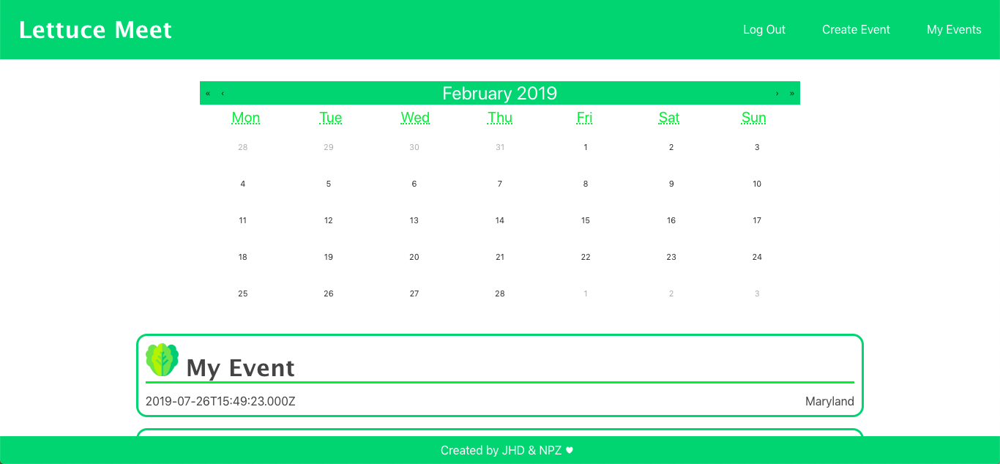
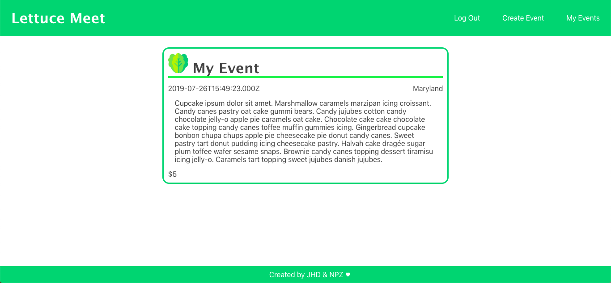

# Lettuce Meet

This project was bootstrapped with [Create React App](https://github.com/facebook/create-react-app).

**Lettuce Meet** allows users to create an account and then create events. View the events on the front page and each event on its own page.

## Project Requirements (for front-end)

:ballot_box_with_check: Your front-end must use React and leverage the backend API in the above requirements.

:ballot_box_with_check: You must use React Router to handle multiple views.

:heavy_minus_sign: You must communicate with the back-end API RESTfully to Create, Read, Update, and Destroy resources (using either fetch or axios).

## Conception & Planning

## Technology Used

:arrow_right: Express

:arrow_right: HTML & CSS

:arrow_right: Javascript

:arrow_right: JSON

:arrow_right: MongoDB & Mongoose

:arrow_right: React.js